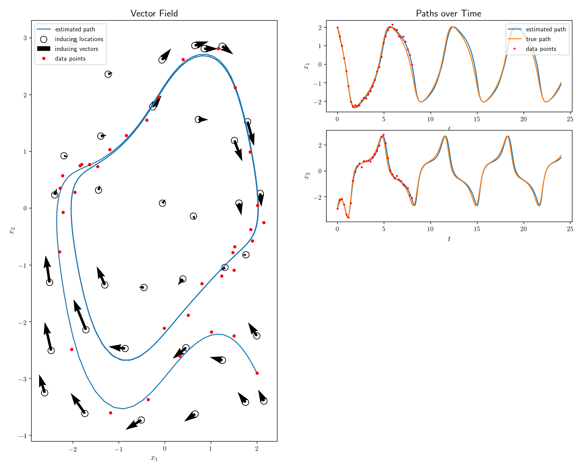
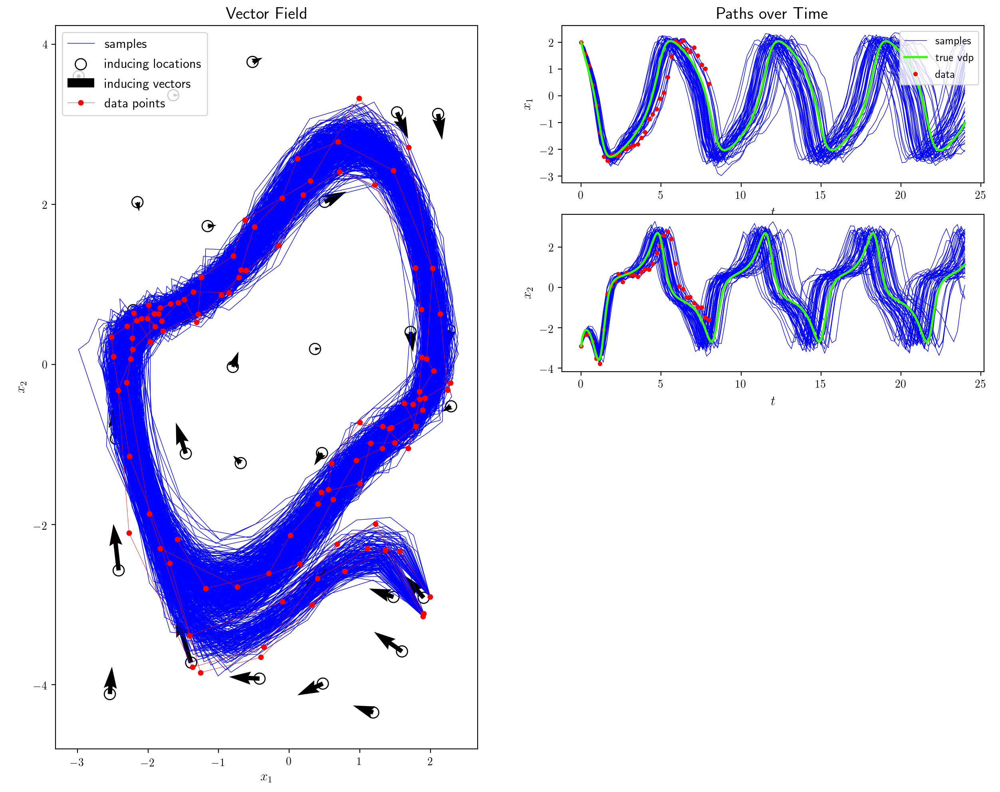
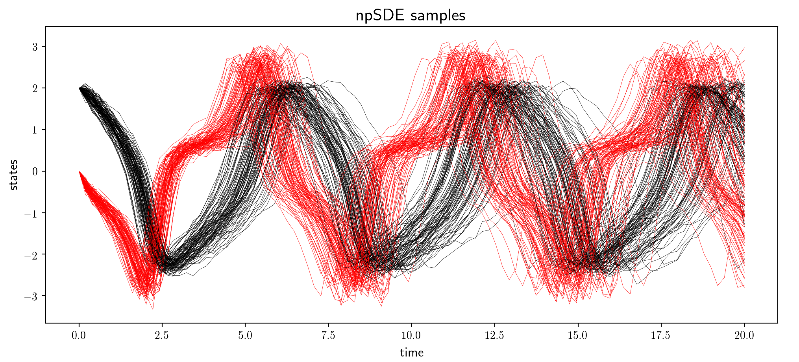

## Nonparametric Differential Equations (npde) with Gaussian Processes

This repository contains a Python implementation of npde - a nonparametric model for learning unknown differential equations. Two related papers are 

 * [Nonparametric stochastic differential equations](https://arxiv.org/abs/1807.05748)
 * [Nonparametric ordinary differential equations](https://arxiv.org/abs/1803.04303)
 
Also, this repository overrides the [old MATLAB implementation](https://github.com/cagatayyildiz/npode) of our ODE model, which was published along with the paper.

### Demo Notebook
More details, figures and usage examples can be found in this [demo notebook](https://github.com/cagatayyildiz/npde/blob/master/demo.ipynb).

### Python Code
The implementation is in Python3.5, and it requires [TensorFlow(1.6.0+)](https://www.tensorflow.org/) and [GPflow(1.1+)](https://github.com/GPflow/GPflow).

Fitting our model on some data is as simple as follows:
```python
npde = build_model(sess, t, Y, model='ode')
npde = fit_model(sess, npde, t, Y) # parameters are the TensorFlow session, time points and observations. model could be ode/sde
```

It is also possible to predict the future
```python
path = npde.predict(x0,t) # x0 and t are the time points and the initial value
```
and sample from the learned model
```python
samples = npde.sample(x0,t,Nw) # Nw is the number of samples
```

``demo.ipynb`` contains some more details, including three example fits where the underlying dynamics are governed by an ODE, SDE with constant diffusion, and SDE with state dependent diffusion. Below are ODE and constant diffusion fits:

#### Example ODE Fit


#### Example SDE Fit


#### SDE Samples


The wrapper function ``build_model`` is where the parameters, kernel, and posterior are initialized - perhaps a good starting point to read the code. Check out the following optional inputs to better understand what's what:
 * ``sf``: drift signal variance
 * ``ell``: drift lengthscale
 * ``sfg``: diffusion signal variance
 * ``ellg``: diffusion lengthscale
 * ``W``: inducing point grid width
 * ``Nw``: number of random draws used for optimizing SDEs
